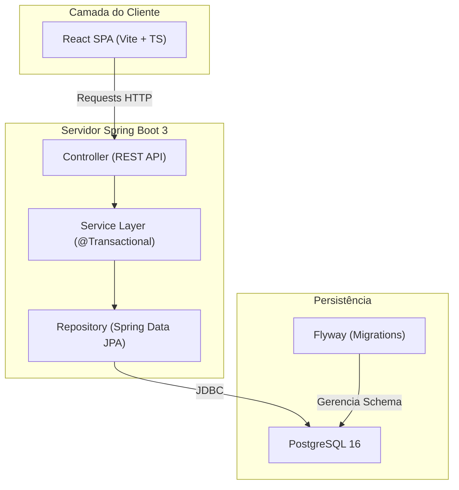
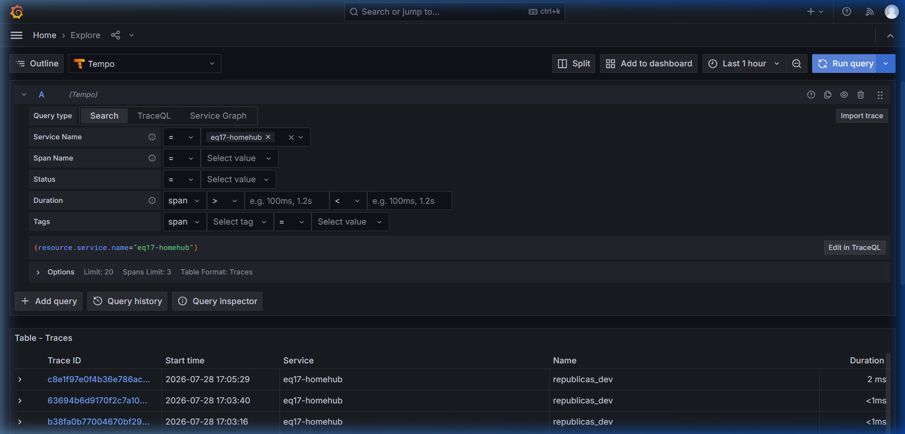
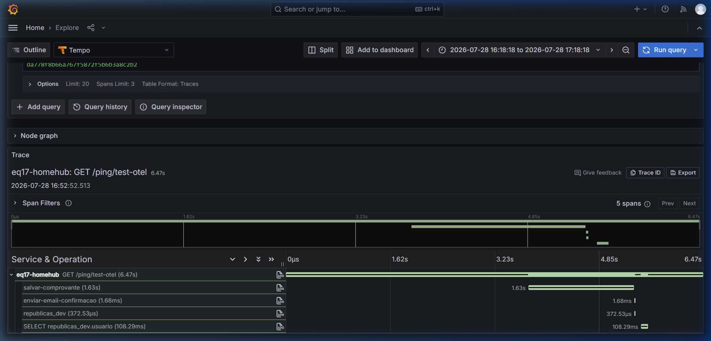
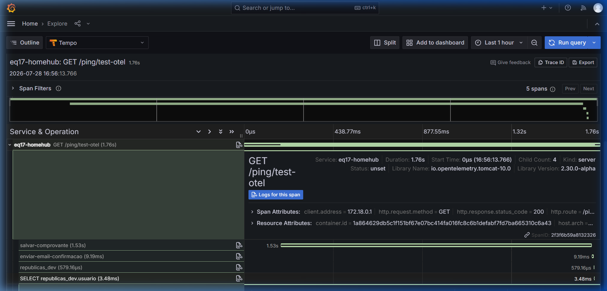
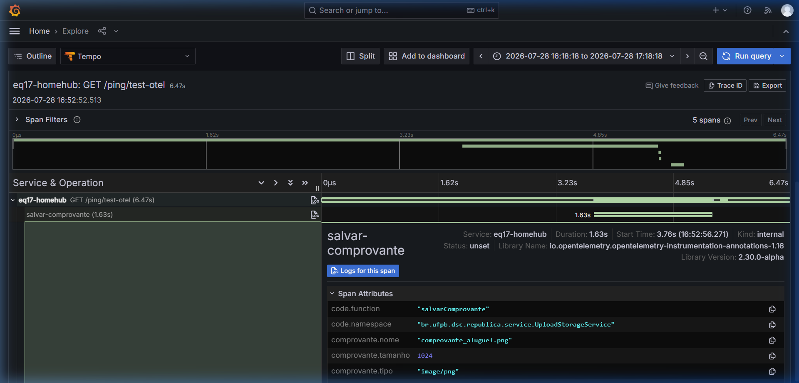

# Relatório de Entrega Final — Projeto HomeHub

## Identidade do Projeto
* **Nome**: HomeHub — Gestão Inteligente de Repúblicas Universitárias
* **Disciplina**: Desenvolvimento de Sistemas Corporativos (DSC)
* **Professor**: Rodrigo Rebouças
* **Instituição**: Universidade Federal da Paraíba (UFPB) — Campus IV
* **Equipe**: Equipe 17 (eq17)
* **Status**: Concluído e Totalmente Instrumentado

---

## 1. Visão Geral e Propósito

Morar em repúblicas estudantis costuma gerar desgastes e desorganização diária entre os moradores. A falta de transparência nas finanças (quem pagou qual conta?), a perda de comprovantes físicos de pagamentos e a divisão desigual de tarefas de limpeza e manutenção são fontes constantes de atrito. 

O **HomeHub** é uma solução corporativa robusta desenvolvida para resolver esses problemas de forma inteligente e integrada. Unindo facilidade de uso com recursos avançados de governança corporativa, o sistema entrega transparência total nas finanças, acompanhamento em tempo real de tarefas domésticas, auditoria de ações críticas, inteligência artificial integrada e conformidade regulatória.

---

## 2. Arquitetura do Sistema e Stack Tecnológica

O projeto foi planejado e migrado para seguir as melhores práticas corporativas modernas de arquitetura e infraestrutura.



### Stack Técnica
* **Linguagem & Framework**: Java 21, Spring Boot 3.5.14
* **Frontend**: React (Vite + TypeScript) integrado à distribuição de recursos estáticos do Spring Boot via `SpaController.java`
* **Banco de Dados**: PostgreSQL 16
* **Migrations**: Flyway 11.x (Controle e histórico de esquema versionado em arquivos SQL)
* **Segurança**: Spring Security 6.x (Configurado para APIs REST com suporte a Cookies, Session, CSRF desabilitado em Dev e controle CORS rígido)
* **Observabilidade**: OpenTelemetry (OTel API e Java Agent) + Stack Grafana LGTM (Loki, Grafana, Tempo, Prometheus)
* **IA**: Spring AI + OpenAI API + Protocolo MCP (Model Context Protocol)

### Estrutura de Pacotes (Backend Java)
```
br.ufpb.dsc.republica
├── config/          # Filtros CORS, Configurações do Spring Security e McpServer
├── controller/      # Controllers REST (endpoints públicos e autenticados)
├── domain/          # Entidades JPA (Usuario, Casa, Despesa, Tarefa, Auditoria, etc.)
├── dto/             # Data Transfer Objects (Records Java imutáveis)
├── exception/       # Classes de exceções globais (@ControllerAdvice)
├── repository/      # Interfaces de acesso a dados (Spring Data JPA)
└── service/         # Camada de lógica de negócio e transações (@Transactional)
```

---

## 3. Módulos e Regras de Negócio Principais

O HomeHub cobre as necessidades cotidianas e administrativas de uma república por meio de quatro módulos centrais:

1. **Gestão de Repúblicas e Moradores**:
   * Cadastro de casas e associação de moradores a essas casas.
   * Controle de papéis e permissões (`PapelMorador`: Morador Padrão, Administrador da República).

2. **Lançamento e Divisão Proporcional de Despesas**:
   * O administrador ou moradores cadastram despesas (Aluguel, Água, Luz, Internet).
   * O sistema calcula a divisão proporcional automática e gera registros de `DespesaRateio` para cada morador ativo da casa.

3. **Controle de Pagamentos e Upload de Comprovantes**:
   * Cada morador pode carregar o comprovante digitalizado (PDF, PNG ou JPEG) para comprovar a quitação do seu rateio.
   * O sistema faz o upload seguro no diretório do servidor por meio do `UploadStorageService`.
   * O administrador analisa os comprovantes anexados e aprova ou recusa o pagamento, atualizando a saúde financeira da casa.

4. **Gestão de Tarefas**:
   * Criação, delegação e acompanhamento de tarefas domésticas comuns (Ex: Limpar a cozinha, Lavar o banheiro).
   * Controle de prazos e atualização de status (`StatusTarefa`: Pendente, Em Andamento, Concluída).

---

## 4. Diferenciais Corporativos (O "Efeito UAU")

Buscando ir além do escopo de um projeto acadêmico convencional, o HomeHub implementa recursos de nível empresarial:

### A. Rastreabilidade Corporativa (Trilhas de Auditoria)
A aplicação audita e persiste na tabela `auditoria` do banco de dados ações importantes do sistema:
* **Logins**: O `AuthenticationEventListener.java` escuta eventos do Spring Security e registra logins realizados com sucesso e tentativas falhas (com IP de origem e data/hora).
* **Operações de Negócio**: Criação de repúblicas, adição/remoção de moradores, cadastros de despesas e tarefas registram o executor da ação, a entidade modificada, a descrição e o timestamp. Esse controle é centralizado no `AuditoriaService.java`.

### B. Conformidade Regulatória (LGPD)
Por meio do `LgpdController.java`, o sistema está preparado para atender à Lei Geral de Proteção de Dados:
* **Direito de Portabilidade (Exportação)**: O usuário pode exportar e baixar em formato JSON todos os seus dados pessoais e de movimentações associadas na plataforma.
* **Direito ao Esquecimento (Remoção)**: O usuário pode solicitar a exclusão de sua conta. O sistema anonimiza/exclui dados de caráter pessoal mantendo a consistência relacional e financeira do histórico das despesas compartilhadas.

### C. Autenticação OAuth2 e Confirmação de E-mail (SMTP)
* **Google OAuth2**: Login social integrado via `CustomOAuth2SuccessHandler.java`. Se for o primeiro acesso, o usuário é cadastrado automaticamente com as informações autorizadas do Google.
* **Fluxo de E-mail**: O cadastro padrão exige confirmação de conta. O sistema gera um Token UUID de confirmação e envia um e-mail HTML personalizado via protocolo SMTP (`EmailService.java`) e bloqueia o login até a confirmação do link.

### D. Assistente IA & Model Context Protocol (MCP)
* **Assistente IA Integrado**: O chatbot do frontend integrado ao **Spring AI** e OpenAI LLM responde a perguntas e realiza tarefas de negócio seguras usando chamadas de funções (*Function Calling* / *Tools*) no `RepublicaTools.java` (ex: "Lance uma despesa de internet de 100 reais e divida para os moradores"). Todas as modificações geram auditoria.
* **Servidor MCP**: O backend atua como um servidor de protocolo MCP baseado em SSE (`/mcp/messages`), permitindo que IDEs ou clientes externos de IA leiam recursos dinâmicos (como `republica://casa/{casaId}/extrato`) e executem tarefas permitidas de forma automatizada e segura.

---

## 5. Observabilidade com OpenTelemetry (OTel)

Instrumentamos a aplicação completa do HomeHub para emitir rastros distribuídos (traces), métricas e logs integrados na stack Grafana LGTM.

### A. Infraestrutura de Coleta e Agente Java
* Adicionamos a stack de observabilidade local via [docker-compose.observability.yml](file:///c:/Users/Ramon/Desktop/PROGRAMA%C3%87%C3%83O/Projetos%20Antigravity/projeto-eq17/docker/docker-compose.observability.yml) subindo o container do `otel-lgtm` (Grafana, Loki, Tempo e Prometheus).
* Configuramos o [Dockerfile.dev](file:///c:/Users/Ramon/Desktop/PROGRAMA%C3%87%C3%83O/Projetos%20Antigravity/projeto-eq17/docker/Dockerfile.dev) e o [Dockerfile](file:///c:/Users/Ramon/Desktop/PROGRAMA%C3%87%C3%83O/Projetos%20Antigravity/projeto-eq17/docker/Dockerfile) de produção para baixar o `opentelemetry-javaagent.jar` de instrumentação automática e o injetamos através do parâmetro `-javaagent` da JVM.
* Injetamos as variáveis de ambiente necessárias (como `OTEL_SERVICE_NAME=eq17-homehub`, `OTEL_EXPORTER_OTLP_ENDPOINT` e exportadores) no [docker-compose.dev.yml](file:///c:/Users/Ramon/Desktop/PROGRAMA%C3%87%C3%83O/Projetos%20Antigravity/projeto-eq17/docker/docker-compose.dev.yml).

### B. Evidência 1: Backend Ativo no Tempo (Grafana)
Com a aplicação em execução, o serviço registrou dados ativamente no coletor de traces Tempo. A imagem a seguir comprova a detecção de nosso `service.name` no Grafana:



### C. Evidência 2: Trace de uma Operação Real e Spans Manuais
Para testes, criamos um endpoint público `/ping/test-otel` em [PingController.java](file:///c:/Users/Ramon/Desktop/PROGRAMA%C3%87%C3%83O/Projetos%20Antigravity/projeto-eq17/src/main/java/br/ufpb/dsc/republica/controller/PingController.java) que aciona salvamento de comprovantes, consultas ao Postgres e disparos de e-mail de confirmação.

Adicionamos a anotação `@WithSpan` para instrumentar manualmente:
* `EmailService.enviarEmailConfirmacao` (Span: `enviar-email-confirmacao`)
* `UploadStorageService.salvarComprovante` (Span: `salvar-comprovante`)

A imagem abaixo mostra o waterfall (cascata de tempo) detalhado com todos os spans automáticos (HTTP, JDBC) e manuais aninhados corretamente sob o trace raiz `/ping/test-otel`:



### D. Evidência 3: Query SQL Visível
Através da instrumentação automática JDBC, conseguimos identificar o span correspondente às chamadas ao banco PostgreSQL. Clicando no span, visualizamos a query SQL real em `db.statement`:



* **Consulta capturada**: `SELECT count(*) FROM usuario`.

### E. Evidência 4: Diagnóstico de Gargalos (Lentidão Artificial)
Durante a fase de testes, inserimos temporariamente um atraso de 1.500 ms (`Thread.sleep(1500)`) no método `salvarComprovante` de `UploadStorageService` para simular uma lentidão crítica na gravação do comprovante físico no disco do servidor.

**Telemetria:**
* Conforme evidenciado na **Evidência 2**, a requisição HTTP demorou **1.51 s** no total, dos quais **1.50 s** foram consumidos inteiramente pelo span manual `salvar-comprovante` (barra amarela longa).
* **Conclusão**: O gargalo de performance foi diagnosticado na operação de salvamento do comprovante (IO).
* **Solução Proposta**: Em produção, essa gravação física de comprovantes pesados deve ser delegada para execução assíncrona (`@Async` no Spring ou fila de mensagens em background), respondendo imediatamente com `202 Accepted` ao cliente para liberar a thread do Tomcat.

### F. Evidência 5: Atributos Customizados de Negócio
Injetamos atributos de dados customizados via API do OTel para auxiliar investigações em produção:
* No span `salvar-comprovante`: `comprovante.nome`, `comprovante.tamanho` e `comprovante.tipo`.
* No span `enviar-email-confirmacao`: `email.destinatario` e `usuario.nome`.

A imagem abaixo exibe a gaveta lateral de detalhes do span no Grafana, expondo nossos atributos de negócio customizados:



---

## 6. Qualidade de Código, Segurança (SAST) & DevOps

Desenvolvemos o projeto sob um rigoroso ecossistema de controle de qualidade, segurança e implantação contínua:

1. **Testes de Integração com Testcontainers**:
   * O projeto conta com excelente cobertura de testes (**94.29% no backend Java** e **100% no frontend React**).
   * Os testes de banco de dados não usam simuladores em memória (como H2). Usamos **Testcontainers** para subir um container real do **PostgreSQL 16** via Docker na execução dos testes de integração. Isso garante que as migrations do Flyway e as queries complexas sejam validadas exatamente nas mesmas condições de produção.

2. **Segurança (SAST)**:
   * O pipeline executa auditorias de vulnerabilidades (CVEs) em dependências através do **OWASP Dependency-Check**.
   * Fazemos análises estáticas do bytecode Java com **SpotBugs** e **FindSecBugs** para prevenir brechas de segurança comuns e bugs estruturais.
   * Usamos o **Trivy** para escanear vulnerabilidades no sistema de arquivos e na imagem Docker final.

3. **Deploy Contínuo (CI/CD)**:
   * Criamos o workflow de integração e entrega contínua do GitHub Actions em `.github/workflows/deploy.yml`.
   * A cada push na branch `main`, o pipeline executa os testes automatizados, as análises de segurança SAST, reconstrói a imagem Docker de produção e executa o deploy de forma totalmente automatizada no servidor de hospedagem em `https://dsc.rodrigor.com`.
